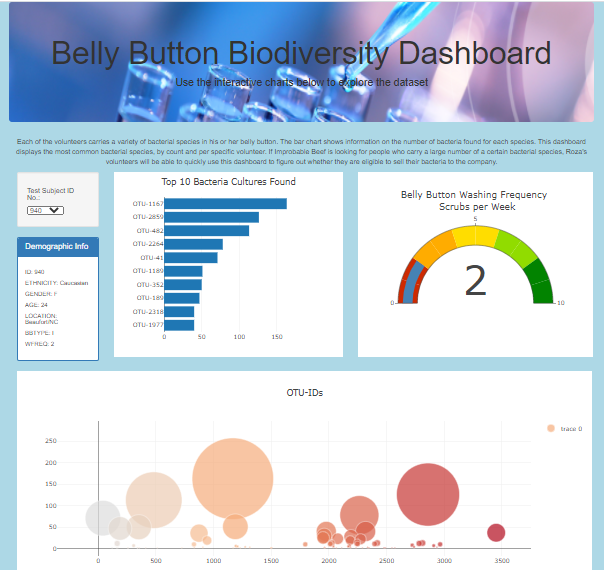

# plotly_deployment
Create a dynamic webpage about belly button bacteria data.

## Overview of Project
**Task:** Build dynamic webpage with charts using plotly of belly button bacteria data and allow users (volunteers of the study) to filter based on id to view their results. The charts included are a bar chart, gauge and bubble chart.

**Method:** Using JavaScript, JQuery,Plotly, HTML, CSS and Bootstrap.

## Resources
- Data Source: [data.js](data.js)
- Source Code: 
    [charts.js](charts.js); [style.css](style.css); [index.html](index.html)
  
- Programming Languages: JavaScript; HTML; CSS
- Software: VS Code

## Results

The following webpage has been built as part of this project.

**Snapshot of final webpage**

